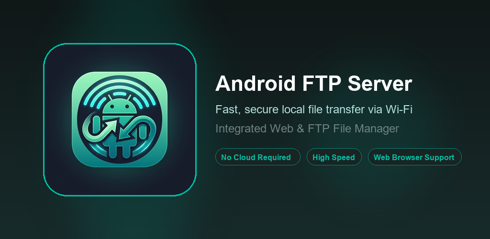
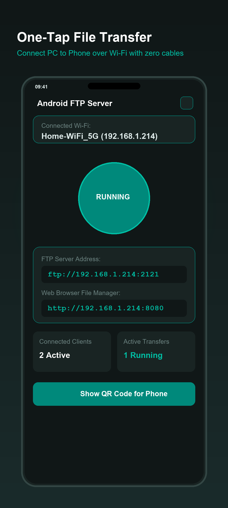
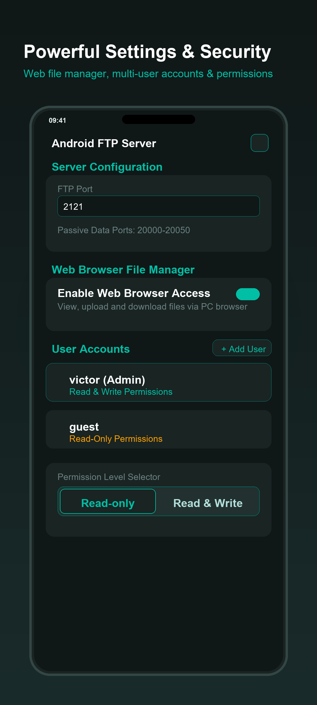

# Android FTP Server

<p align="center">
  
</p>

<p align="center">
  <strong>Fast, secure, local Wi-Fi FTP server and Web Browser File Manager for Android.</strong>
</p>

<p align="center">
  
  
  
  
  
</p>

---

## 🌟 Overview

**Android FTP Server** turns your Android device into a high-speed, local file server. Wirelessly browse, upload, download, and manage files between your phone or tablet and any computer (PC, Mac, Linux) over your local Wi-Fi network without cables, third-party software, or external cloud services.

Includes an **integrated Web Browser File Manager**, allowing you to transfer and manage files directly from any web browser (Chrome, Safari, Edge, Firefox) without needing a dedicated FTP client.

---

## 📱 Screenshots

<p align="center">
  
  &nbsp;&nbsp;&nbsp;&nbsp;
  
</p>

---

## ✨ Features

- **🚀 One-Tap Server**: Start and stop the FTP server with a single tap.
- **🌐 Web Browser File Manager**: Access, view, upload, download, and organize files directly through any web browser on port `8080`.
- **📷 QR Code Quick Connect**: Display a QR code on your screen to effortlessly connect other mobile devices or browsers without typing URLs.
- **👥 Multi-User Accounts & Access Control**:
  - Create and edit multiple user accounts.
  - Granular permission levels: **Read-Only** or **Read & Write**.
  - High-contrast segmented permission selector.
  - Anonymous login mode with configurable write access.
- **⚡ High-Speed Local Wi-Fi**: Utilizes your full local network bandwidth for transfer speeds without internet consumption.
- **🔋 Battery-Optimized Foreground Service**: Transfers continue uninterrupted when your screen turns off or while using other apps.
- **🎨 Modern Material 3 UI**: Clean, responsive layout with full dynamic Dark and Light theme support.
- **🔒 100% Private & Offline**: Zero analytics, zero tracking, zero external telemetry. All communications are strictly point-to-point on your local network.

---

## 🛠 Tech Stack & Architecture

- **Language**: Kotlin 2.2.x
- **UI Framework**: Jetpack Compose with Material 3
- **FTP Engine**: [Apache MINA FtpServer 1.2.0](https://mina.apache.org/ftpserver-project/)
- **Web Manager**: Embedded lightweight HTTP server
- **Discovery**: SSDP / UPnP multicast responder
- **State Management**: Kotlin Coroutines & `StateFlow`
- **Persistence**: SharedPreferences / AndroidX DataStore

---

## 🚀 Getting Started

### Prerequisites
- Android Studio Hedgehog or newer
- JDK 17 or 21
- Android SDK 35 (Android 15)

### Building from Source

1. Clone the repository:
   ```bash
   git clone https://github.com/Victor-Gomez/android-ftp-server.git
   cd android-ftp-server
   ```

2. Build the debug APK:
   ```bash
   ./gradlew assembleDebug
   ```
   The APK will be located at `app/build/outputs/apk/debug/app-debug.apk`.

3. Build the release App Bundle (.aab):
   ```bash
   # Copy keystore configuration template
   cp keystore.properties.example keystore.properties
   # Edit keystore.properties with your signing details

   ./gradlew bundleRelease
   ```
   The bundle will be located at `app/build/outputs/bundle/release/app-release.aab`.

---

## 📄 Privacy Policy

See our complete [Privacy Policy](store_assets/PRIVACY_POLICY.md) (or [HTML version](store_assets/privacy.html)).

---

## 👨‍💻 Author

**Victor Gomez**  
Website: [https://victorgomez.studio](https://victorgomez.studio)  
GitHub: [@Victor-Gomez](https://github.com/Victor-Gomez)

---

## 📜 License

```
Copyright 2026 Victor Gomez (victorgomez.studio)

Licensed under the Apache License, Version 2.0 (the "License");
you may not use this file except in compliance with the License.
You may obtain a copy of the License at

    http://www.apache.org/licenses/LICENSE-2.0

Unless required by applicable law or agreed to in writing, software
distributed under the License is distributed on an "AS IS" BASIS,
WITHOUT WARRANTIES OR CONDITIONS OF ANY KIND, either express or implied.
See the License for the specific language governing permissions and
limitations under the License.
```
